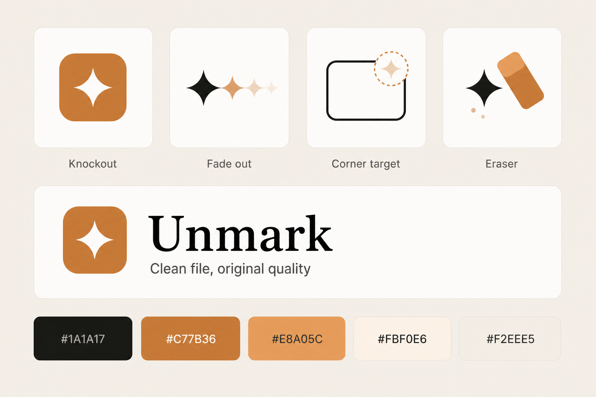

# Unmark frontend

<p align="center">
  
</p>

<p align="center">
  <strong>Unmark</strong> — remove Gemini / Veo sparkle watermarks<br />
  <a href="https://unmark.ink">unmark.ink</a>
</p>

Next.js web app for [unmark.ink](https://unmark.ink).

## Brand graphics

Primary app icon (**Knockout** — copper tile, white sparkle):

<p align="center">
  
</p>

Logo themes, wordmark, and palette (concept sheet):

<p align="center">
  
</p>

| Theme | Idea |
|-------|------|
| **Knockout** | Primary mark — copper tile, white sparkle cutout |
| **Fade out** | Sparkle disappearing left to right |
| **Corner target** | Detection frame — sparkle locked in the corner |
| **Eraser** | Removal in action — sparkle wiped to dust |

**Palette**

| Name | Hex |
|------|-----|
| Ink | `#1A1A17` |
| Copper | `#C77B36` |
| Peach | `#E8A05C` |
| Cream | `#FBF0E6` |
| Sand | `#F2EEE5` |

Assets: [`public/brand/`](public/brand/) · Live page: [`/brand`](https://unmark.ink/brand)  
React marks: [`components/brand/logos.tsx`](components/brand/logos.tsx)

## Local

```bash
cp .env.example .env.local   # edit if needed
npm install
npm run dev
```

Companion repos (run separately): **backend**, **chrome-extension**, **cli**.

## Secrets

Never commit `.env.local` or `.env`. Only `.env.example` is safe.

```bash
./scripts/check-no-secrets.sh
```

## Deploy to Azure (GitHub Actions)

Same model as AWS EKS: **build `Dockerfile` → push to registry → run container** on port 3000 with the same `NEXT_PUBLIC_*` URLs. On Azure this uses **Container Apps** (managed containers — no Kubernetes cluster to operate; ACR replaces ECR).

| AWS (EKS) | Azure |
|-----------|-------|
| ECR `unmark-frontend:latest` | ACR `unmarkacr.azurecr.io/unmark-frontend:latest` |
| `frontend-deployment.yaml` (3 replicas) | Container App (min 1 / max 3) |
| ALB ingress | Container Apps HTTPS ingress |

**One-time Azure setup** (from this repo root):

```bash
az login
./infra/azure/provision.sh
```

Add GitHub **secret** `AZURE_CREDENTIALS` and **repository variables** on **this frontend repo**: `AZURE_RESOURCE_GROUP`, `ACR_NAME`, `AZURE_CONTAINER_APP_NAME`, `AZURE_CONTAINER_APP_ENV`, `AZURE_LOCATION`, plus `NEXT_PUBLIC_*` URLs.

**Deploy:** push to `main`, or **Actions → Deploy frontend to Azure → Run workflow**.

Workflow: [`.github/workflows/frontend-azure.yml`](.github/workflows/frontend-azure.yml)

Point `unmark.ink` at the Container App FQDN (Azure custom domain + Namecheap DNS). Backend stays on AWS; only the web UI runs on Azure.
